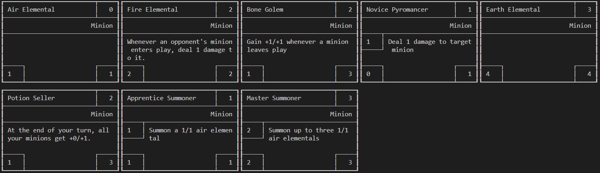
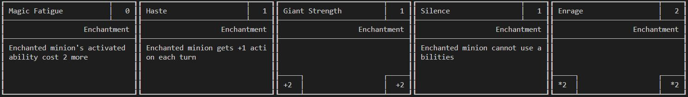
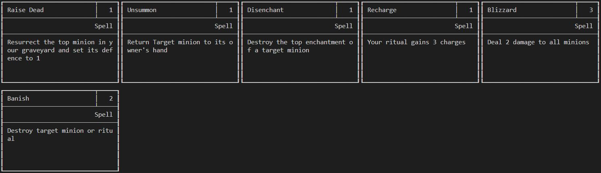
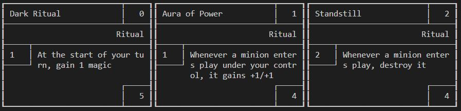
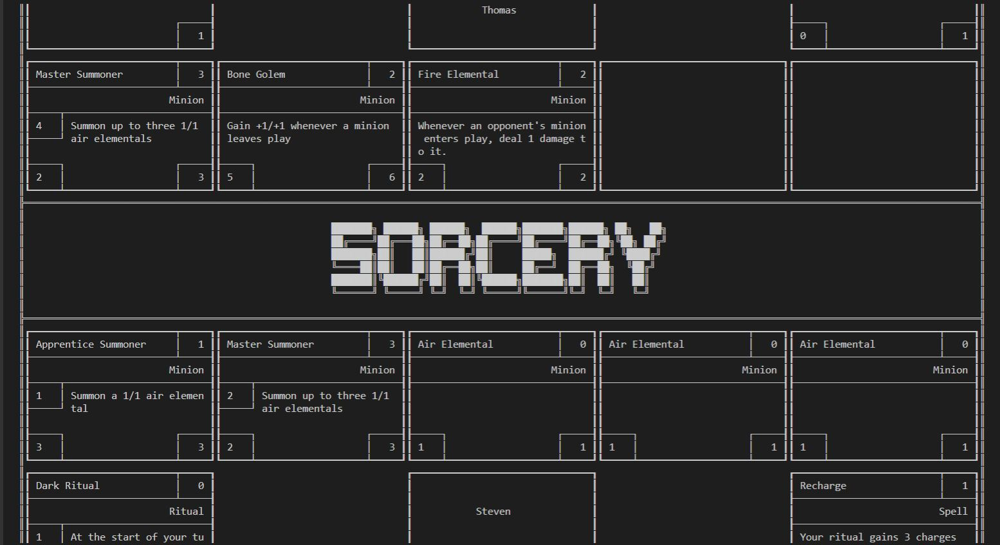

# **Sorcery**

Sorcery is a card game based on the genre of collectible card games such as Hearthstone and MTG.

This game was made for the final project for our CS246(Object Oriented Programming) course at the University of Waterloo.

Players can choose to summon minions, cast spells, play rituals or enchant allies in order to secure a strategic victory against their opponents!

## **Minions**
Minions can be summoned on the board and have the ability to attack players and enemy minions alike.

&nbsp;

## **Enchantments**
Enchantments can be used to apply a buff or debuff on a minion.

&nbsp;

## **Spells**
Spells can be casted at any card on the board. 

&nbsp;

## **Rituals**
Rituals can be played only once at a time for each player and contains trigger effects whenever an event occurs.

&nbsp;

# **Demo** 

&nbsp;

# **Source Code**
Since this project was created for a course at the University of Waterloo, there are Intellectual Property and Academic Integrity agreements that come along with it. 
Hence, if you want to look at the source code, please message one of our contributors down below. 
Additionally, they might provide you a password to the private repo in their resume!
&nbsp;

# **Contributors**

[Thomas](https://github.com/thomjasz) - Frontend Developer

[Simon](https://github.com/simonofalltrades) - Backend Developer (Player and Game Logic)

[Steven](https://github.com/stevennx) - Backend Developer (Cards Logic) and Lead Bugfixer
